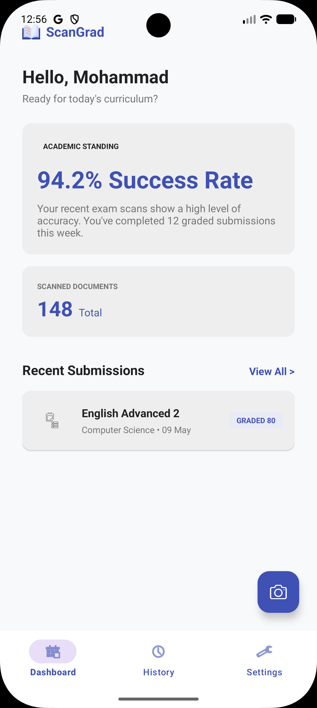
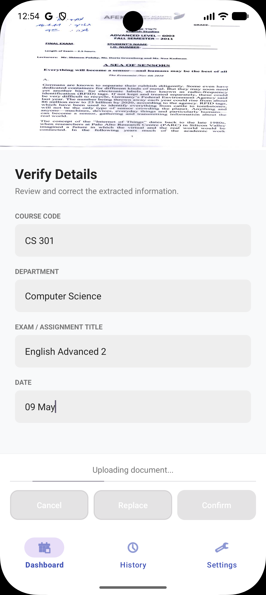
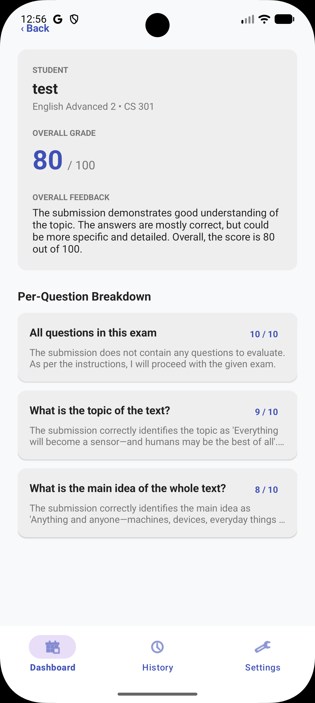

# ScanGrad 🎓

An AI-powered grading platform for handwritten exams, built with Android (Kotlin) and a Python FastAPI backend.

## 📸 App Screenshots

<div align="center">
  
  &nbsp;&nbsp;&nbsp;
  
  &nbsp;&nbsp;&nbsp;
  
</div>

## 🚀 Overview
ScanGrad streamlines the grading process by digitizing handwritten exams and evaluating them against predefined course rubrics. 

**Current Prototype Status:** The system is in a functional prototype phase. The Android frontend and FastAPI backend are fully integrated alongside Firebase. AI grading is temporarily mocked using a "Wizard of Oz" methodology to demonstrate the API data flow prior to the full implementation of the Gemini 1.5 RAG pipeline.

## 🛠️ Tech Stack
* **Frontend:** Android, Kotlin, CameraX, Retrofit
* **Backend:** Python, FastAPI, Uvicorn
* **Database & Storage:** Firebase Firestore, Firebase Cloud Storage
* **Planned AI Pipeline:** ChromaDB, SentenceTransformers (`all-MiniLM-L6-v2`), Gemini 1.5 API

---

## 💻 How to Run Locally

### 1. Start the Backend Server (FastAPI)
Ensure you have Python installed. Open your terminal, navigate to the backend directory, and run the following commands:

```bash
# Install the required dependencies
pip install -r requirements.txt

# Start the local server
uvicorn main:app --host 0.0.0.0 --port 8000 --reload
