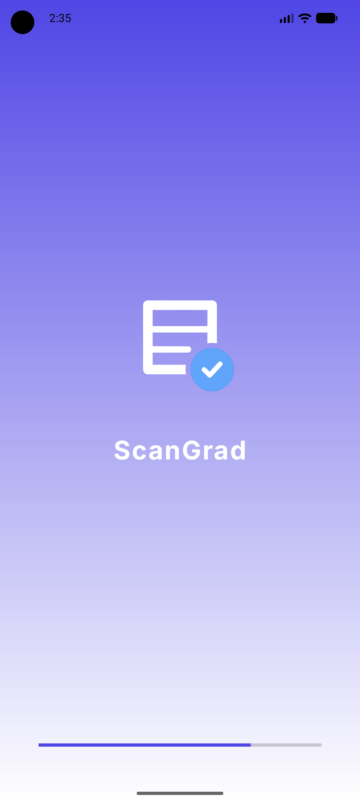
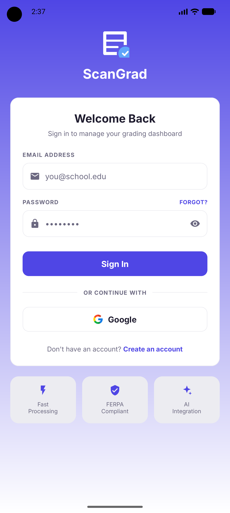
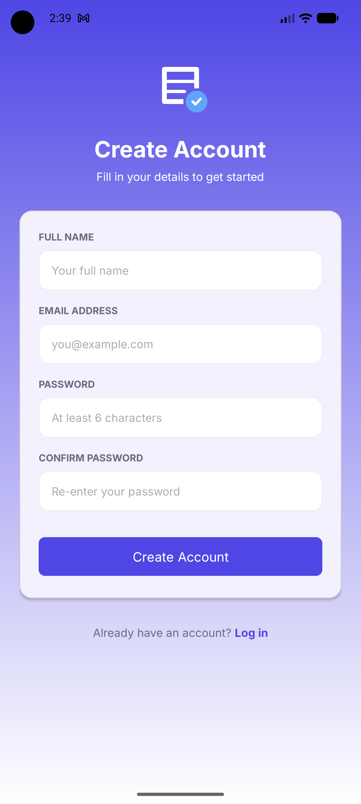
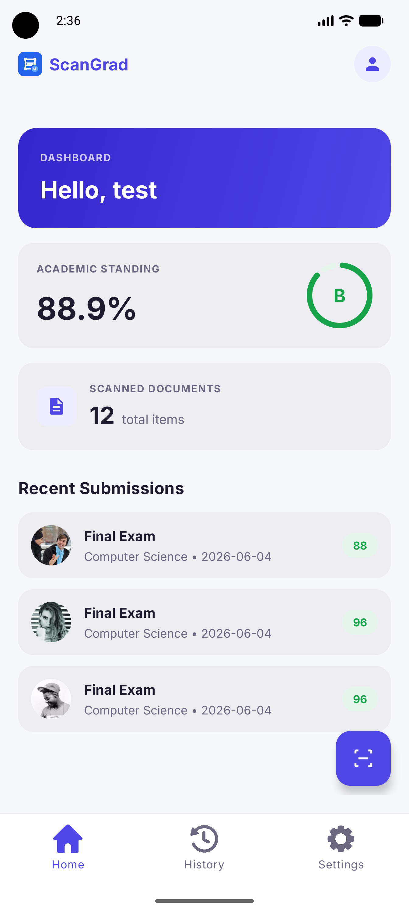
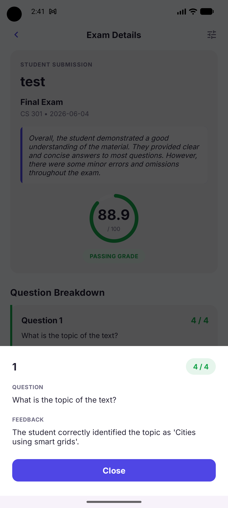
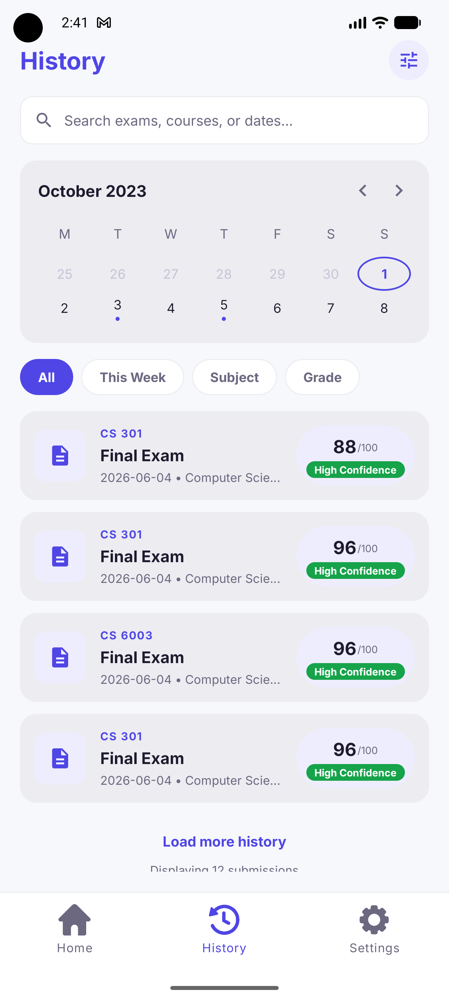
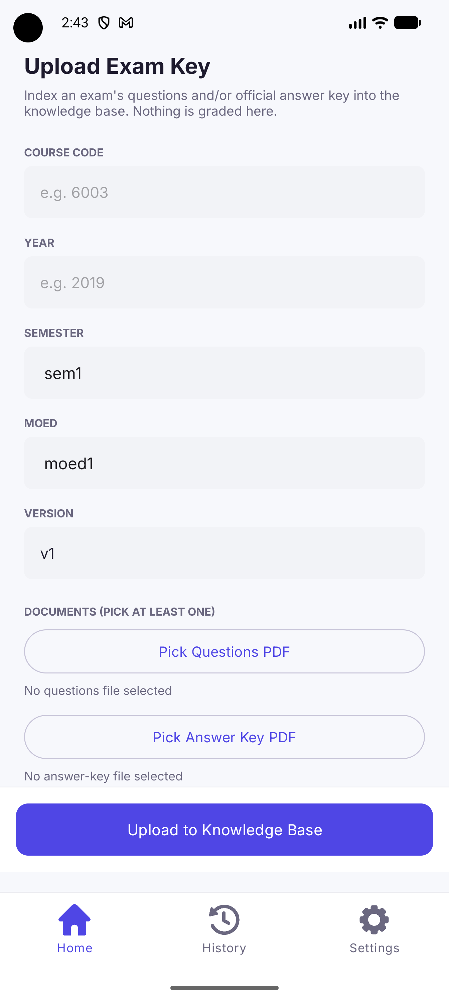
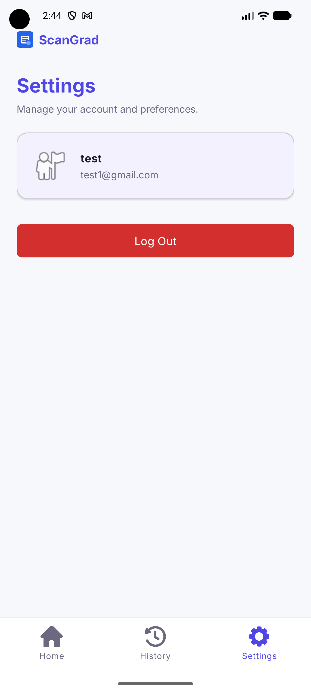

# ScanGrad 🎓

An end-to-end, AI-powered grading platform for handwritten exams. ScanGrad digitizes physical answer sheets through an **Android client** and grades them with a custom **Hybrid-LLM Retrieval-Augmented Generation (RAG)** pipeline running on a **FastAPI** backend.

The Android app captures or uploads scans, lets the user validate the extracted text, and displays per-question scores, transcribed answers, and explanations. The backend OCRs submissions, retrieves relevant rubrics and past questions from a vector database, and returns a strict, structured grade scaled to 100.

---

## 📑 Table of Contents

- [🚀 Overview](#-overview)
- [📸 App Screenshots](#-app-screenshots)
- [🏗️ Architecture](#️-architecture)
- [📱 Frontend (Android)](#-frontend-android)
  - [Screens & Flow](#screens--flow)
  - [Frontend Tech Stack](#frontend-tech-stack)
  - [Frontend Structure](#frontend-structure)
- [⚙️ Backend (FastAPI + RAG)](#️-backend-fastapi--rag)
  - [The AI Grading Pipeline (RAG)](#the-ai-grading-pipeline-rag)
  - [Backend Tech Stack](#backend-tech-stack)
  - [Backend Structure](#backend-structure)
  - [API Reference](#api-reference)
  - [Backend Setup](#backend-setup)
- [📂 Repository Structure](#-repository-structure)

---

## 🚀 Overview

ScanGrad bridges the gap between physical examinations and automated digital grading. A student or professor captures images of handwritten exam submissions using the Android client. The app extracts the text via OCR on the backend, lets the user validate it, and sends it to the FastAPI server, where a LangChain RAG system evaluates each answer against a vector database of course-specific rubrics and past examples.

Teachers can also **ingest** new exams and answer keys at runtime, which are chunked and embedded into the same vector store so future submissions are graded against them.

On startup the backend publishes its **local IP** to Firebase Firestore, so the mobile app can discover the API address dynamically on the local network.

---

## 📸 App Screenshots

> Screenshots live in the [`screenshots/`](screenshots/) folder. Capture each screen and save it under the filename listed below.

<div align="center">

| Splash | Login | Sign Up |
|:---:|:---:|:---:|
|  |  |  |

| Dashboard / Home | Camera Capture | Text Validation |
|:---:|:---:|:---:|
|  |  |  |

| Grading Results | Question Detail | History |
|:---:|:---:|:---:|
|  |  |  |

| Ingest Exam / Answer Key | Settings | |
|:---:|:---:|:---:|
|  |  | |

</div>

---

## 🏗️ Architecture

ScanGrad uses a **monorepo** that keeps the Android frontend and Python backend synchronized. The two communicate over a REST API discovered dynamically through Firebase.

```
┌──────────────────────────┐                       ┌────────────────────────────────────────┐
│      Android Client       │                       │            FastAPI Backend             │
│   (Kotlin · MVVM · CameraX)│                       │         (LangChain · RAG Engine)        │
│                           │                       │                                        │
│  Camera / Upload          │   POST /api/evaluate  │   OCR (RapidOCR + pdfium)              │
│  Validate extracted text  │ ────────────────────▶ │      │                                 │
│  View per-question grades │                       │      ▼                                 │
│                           │ ◀──────────────────── │   RAG Generator                        │
│                           │  EvaluationResponse   │   1. Multi-query expansion (llama3.2)  │
│  Teacher ingest exams     │   POST /api/ingest    │   2. Metadata-filtered retrieval       │
│                           │ ────────────────────▶ │      (ChromaDB, scoped by course_code) │
│                           │                       │   3. Strict grading (llama3.1:8b)      │
│                           │                       │   4. Deterministic score normalization │
└───────────┬──────────────┘                       └─────────────────┬──────────────────────┘
            │                                                         │
            │            ┌──────────────────────────┐                │
            └──────────▶ │   Firebase (Firestore +   │ ◀──────────────┘
        IP discovery /   │   Auth + Storage)         │   publishes local IP on startup
        auth / scans     └──────────────────────────┘
```

**End-to-end flow:** `Splash → Login/Signup → Dashboard → Camera/Upload → OCR → Validation → /api/evaluate → Grading Results`.

---

## 📱 Frontend (Android)

A native Kotlin app built on the **MVVM** pattern. It handles camera capture (CameraX), Firebase auth, dynamic API discovery, and rendering of structured grading results.

### Screens & Flow

| Screen | Source | Screenshot file | Purpose |
|--------|--------|-----------------|---------|
| Splash | `SplashActivity` | `splash_view.png` | Branded launch screen / entry point |
| Login | `LoginActivity` | `login_view.png` | Firebase email + Google sign-in |
| Sign Up | `SignupActivity` | `signup_view.png` | New account registration |
| Dashboard / Home | `DashboardFragment` | `dashboard_view.png` | Recent submissions, entry to scanning |
| Camera Capture | `CameraFragment` | `camera_view.png` | CameraX capture of answer sheets |
| Text Validation | `ValidationFragment` | `validation_view.png` | Review & edit OCR-extracted text before grading |
| Grading Results | `SubmissionDetailsFragment` | `results_view.png` | Overall score + per-question evaluations |
| Question Detail | `QuestionDetailDialogFragment` | `question_detail_view.png` | Drill-down into a single question's grade & explanation |
| History | `HistoryFragment` | `history_view.png` | Past graded submissions |
| Ingest Exam / Answer Key | `IngestFragment` | `ingest_view.png` | Teacher uploads new exams/answer keys to the vector store |
| Settings | `SettingsFragment` | `settings_view.png` | App configuration |

> `HostActivity` hosts the three bottom-nav tabs (**Home**, **History**, **Settings**) and pushes the Camera → Validation → Results flow onto the back stack.

### Frontend Tech Stack

| Concern | Tool |
|---------|------|
| Language | Kotlin |
| Architecture | MVVM (ViewModel + LiveData) |
| UI | Android Views + ViewBinding, Jetbrains Compose (Material 3), Lottie animations |
| Camera | CameraX (`camera-core`, `camera2`, `lifecycle`, `view`) |
| Networking | Retrofit 2 + Gson |
| Image loading | Coil |
| Auth / Backend services | Firebase Auth, Firestore, Storage, Google Play Services Auth |

### Frontend Structure

```text
android/
└── app/src/main/java/com/example/scangrad/
    ├── ui/              # Activities, Fragments, dialogs (screens)
    ├── viewmodel/       # EvaluationViewModel, IngestViewModel
    ├── data/            # Submission, HistoryRecord, User models
    ├── network/         # Retrofit api, EvaluationService, repository, models
    ├── db/              # FirebaseManager (auth, Firestore, IP discovery)
    └── utils/           # RecyclerView adapters (history, recent submissions)
```

---

## ⚙️ Backend (FastAPI + RAG)

A FastAPI service that grades scanned exam submissions using a **RAG (Retrieval-Augmented Generation)** pipeline. It OCRs student answer sheets, retrieves relevant rubrics and past questions from a vector database, and produces a strict, structured grade for every question — scaled to 100.

### The AI Grading Pipeline (RAG)

ScanGrad uses an advanced **Multi-Query Retrieval** strategy to ensure accurate, rubric-aligned grading while efficiently managing local model resources.

```
        ┌───────────────┐     image / PDF URL      ┌──────────────┐
 App ──▶ │ POST /evaluate │ ───────────────────────▶ │     OCR      │  RapidOCR (+ pdfium for PDFs)
        └──────┬────────┘                           └──────┬───────┘
               │ extracted text                            │
               ▼                                           ▼
        ┌─────────────────────────────────────────────────────────┐
        │                     RAG Generator                        │
        │  1. Multi-query expansion (llama3.2:3b)                   │
        │  2. Metadata-filtered retrieval from ChromaDB            │
        │     (rubric / question chunks, scoped by course_code)    │
        │  3. Strict grading + structured output (llama3.1:8b)     │
        │  4. Deterministic score normalization (clamp + rescale)  │
        └────────────────────────────┬────────────────────────────┘
                                      ▼
                         EvaluationResponse (JSON)
```

1. **OCR & Text Extraction:** The server receives the image/PDF URL, downloads the file, and extracts the handwritten text with RapidOCR (PDFs rendered via pypdfium2).
2. **Multi-Query Generation (`llama3.2:3b`):** The original exam question is fed to a local Llama model that generates several distinct, optimized search queries.
3. **Vector Retrieval (ChromaDB):** Those queries search the Chroma vector store for relevant past examples, rubrics, and penalty rules — scoped by `course_code` with a fallback to unfiltered semantic search. The unique union forms the context window.
4. **Structured Evaluation (`llama3.1:8b`):** The student submission, exam question, and retrieved context are passed to the grading model, which maps its response precisely to a Pydantic `EvaluationResponse` so the client receives perfectly formatted JSON.
5. **Deterministic Normalization:** Each score is clamped to `[0, max_score]` and `overall_score` is recomputed as `(Σ score / Σ max_score) × 100`. The grading LLM runs at `temperature=0`, so grades are reproducible run-to-run.

### Backend Tech Stack

| Concern | Tool |
|---------|------|
| API framework | FastAPI / Uvicorn |
| Orchestration | LangChain |
| Vector store | ChromaDB (persisted to `./chroma_db`) |
| Embeddings | `sentence-transformers/all-MiniLM-L6-v2` (normalized, CPU) |
| LLMs (local) | Ollama — `llama3.2:3b` (query expansion), `llama3.1:8b` (grading) |
| OCR | RapidOCR (ONNX runtime) + pypdfium2 for PDF rendering |
| Service discovery | Firebase Admin (Firestore) |
| Validation / schemas | Pydantic v2 |

### Backend Structure

```text
backend/
├── main.py            # FastAPI app + routes (/health, /api/evaluate, /api/ingest)
├── config.py          # env loading, Firebase init, IP publishing, app lifespan
├── models.py          # Pydantic request/response schemas
├── generator.py       # RAGGenerator: query expansion, retrieval, grading, normalization
├── chunker.py         # Runtime chunker for uploaded exams / answer keys
├── ocr.py             # RapidOCR + PDF rendering, async URL → text
├── indexer.py         # Offline builder: JSONL corpus → ChromaDB
├── requirements.txt
├── data/chunks/       # Pre-processed exam corpus (.jsonl) — gitignored
├── chroma_db/         # Persisted vector store — gitignored
└── tests/             # pytest suite
```

### API Reference

#### `GET /health`
Liveness check.
```json
{ "status": "ok", "message": "LangChain RAG Engine Online" }
```

#### `POST /api/evaluate`
Grade a student submission. Provide `extracted_text` directly, or an `image_url` to OCR.

**Request**
```json
{
  "submission_id": "sub_123",
  "course_code": "6003",
  "exam_question": "Explain the causes of the 1929 crash...",
  "extracted_text": "",
  "image_url": "https://.../submission.pdf"
}
```

**Response**
```json
{
  "overall_score": 84.5,
  "evaluations": [
    {
      "question_id": "Q1",
      "question_text": "Explain the causes of the 1929 crash (15 points)",
      "student_answer": "The crash was caused by...",
      "score": 12.0,
      "max_score": 15.0,
      "explanation": "Identifies speculation and over-leverage but omits the role of monetary policy."
    }
  ],
  "general_feedback": "Strong on causes, weaker on consequences.",
  "confidence_level": "HIGH"
}
```

- `max_score` is read from the point value printed next to each question (defaults to 10).
- Scores are **deterministically normalized** (see pipeline step 5).
- `confidence_level` is `HIGH` when relevant rubrics were retrieved, `LOW` otherwise.

#### `POST /api/ingest`
Add a new exam and/or answer key to the live vector store. Provide inline text **or** a URL to OCR for each document; at least one is required. Ingestion is **idempotent** — re-uploading the same exam upserts the same `chunk_id`s instead of duplicating.

**Request**
```json
{
  "course_code": "6003",
  "year": "2024",
  "semester": "1",
  "moed": "1",
  "version": "v1",
  "questions_text": "1. ...",
  "answer_key_url": "https://.../answer_key.pdf"
}
```

**Response**
```json
{
  "doc_id": "6003_2024_1_1_v1",
  "chunks_added": 14,
  "chunk_ids": ["6003_2024_1_1_v1_q1", "..."],
  "chunk_types": { "question": 7, "answer_key": 7 },
  "mode": "paired"
}
```

`mode` is one of `paired`, `answer_key_only`, or `questions_only`.

### Backend Setup

**Prerequisites**
- **Python 3.11+**
- **[Ollama](https://ollama.com/)** running locally with the grading models pulled:
  ```bash
  ollama pull llama3.2:3b
  ollama pull llama3.1:8b
  ```
- A **Firebase service account** (`serviceAccountKey.json`) in the backend root — used to publish the server IP to Firestore.
- A **Google API key** (`GOOGLE_API_KEY`).

**Steps**

1. **Create a virtual environment and install dependencies**
   ```bash
   python -m venv .venv
   .venv\Scripts\activate         # Windows
   # source .venv/bin/activate     # macOS / Linux
   pip install -r requirements.txt
   ```

2. **Create a `.env` file** in the backend root:
   ```env
   GOOGLE_API_KEY=your_google_api_key

   # Optional — LangSmith tracing
   LANGCHAIN_TRACING_V2=true
   LANGCHAIN_ENDPOINT=https://api.smith.langchain.com
   LANGCHAIN_API_KEY=your_langchain_key
   LANGCHAIN_PROJECT=scangrad
   ```

3. **Add `serviceAccountKey.json`** (Firebase service account credentials) to the backend root.

4. **Build the vector store** from the pre-processed corpus (one-time, populates `./chroma_db`):
   ```python
   from indexer import DocumentIndexer
   DocumentIndexer("data/chunks").build_vectorstore()
   ```

5. **Run the server**
   ```bash
   uvicorn main:app --host 0.0.0.0 --port 8000
   ```
   On startup the server prints its local IP and publishes it to Firestore. Interactive API docs: `http://localhost:8000/docs`.

6. **Run the tests**
   ```bash
   pytest
   ```

> `.env`, `serviceAccountKey.json`, `chroma_db/`, and `data/` are gitignored — they are never committed.

---

## 📂 Repository Structure

This project uses a monorepo to keep the frontend and backend synchronized.

```text
ScanGrad/
├── android/                # Kotlin Android Studio project
│   └── app/src/main/
│       ├── java/com/example/scangrad/
│       │   ├── ui/         # Screens (Activities, Fragments, dialogs)
│       │   ├── viewmodel/  # MVVM ViewModels
│       │   ├── data/       # Domain models
│       │   ├── network/    # Retrofit API + repository
│       │   ├── db/         # FirebaseManager
│       │   └── utils/      # RecyclerView adapters
│       └── res/            # Layouts, drawables, themes
├── backend/                # Python FastAPI & LangChain project
│   ├── main.py             # API endpoints
│   ├── generator.py        # Dual-LLM RAG pipeline engine
│   ├── ocr.py              # Image/PDF text extraction
│   ├── indexer.py          # Offline corpus → ChromaDB builder
│   ├── chunker.py          # Runtime ingestion chunker
│   ├── config.py           # Env, Firebase, lifespan
│   └── models.py           # Pydantic data models
├── screenshots/            # App screenshots (see Screenshots section)
└── README.md
```
